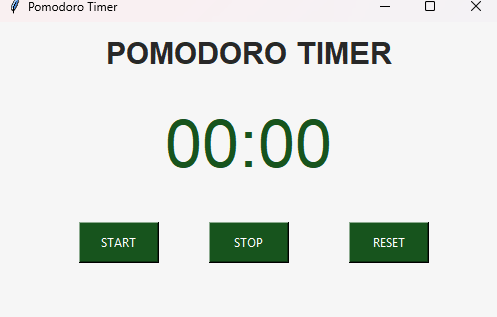

# 🍅 PyPomodoro Timer

A simple, effective Pomodoro Timer built using **Python** and **Tkinter**. This application helps users manage their time effectively using the Pomodoro Technique (25 minutes of work followed by a 5-minute break).


## 📸 Screenshots



## ✨ Features

* **Timer Logic:** Accurate countdown mechanism for work and break sessions.
* **GUI Interface:** Clean and user-friendly interface using Tkinter.
* **Start/Reset Controls:** Ability to pause, resume, or reset the timer.
* **Visual Feedback:** Updates the window dynamically as time counts down.

## 🛠️ Tech Stack

* **Language:** Python 3
* **Library:** Tkinter (Standard Python GUI library)
* **Modules:** `math` (for time calculation)

## 🚀 How to Run

1.  **Clone the repository:**
    ```bash
    git clone [https://github.com/YOUR_USERNAME/YOUR_REPO_NAME.git](https://github.com/YOUR_USERNAME/YOUR_REPO_NAME.git)
    ```
2.  **Navigate to the project directory:**
    ```bash
    cd YOUR_REPO_NAME
    ```
3.  **Run the application:**
    ```bash
    python main.py
    ```
    *(Note: Replace `main.py` with the actual name of your python file if it is different)*

## 📂 Project Structure

```text
├── pomodono.py          # The source code for the timer
├── image.png   # Image of the app (optional)
└── README.md        # Project documentation
